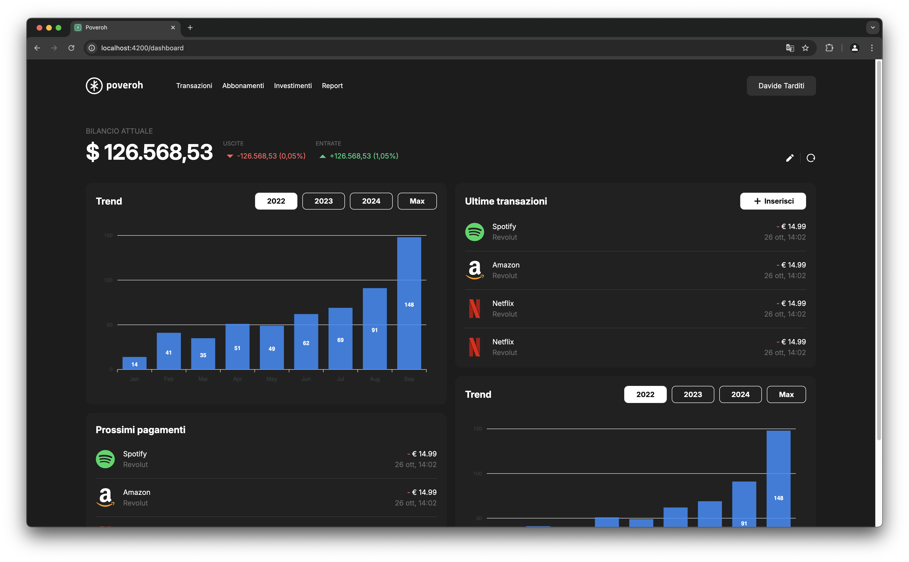

<div align="center">


# Poveroh

#### A single platform to track poverty.

<h4>
    <a href="https://github.com/DavideTarditi/poveroh/issues/">Report Bug</a>
  <span> · </span>
    <a href="https://github.com/DavideTarditi/poveroh/issues/">Request Feature</a>
  </h4>

<div>

[](https://opensource.org/licenses/MIT)

</div>

---

> “Money doesn’t buy happiness, but I’d rather cry in a Ferrari.”

</div>

<hr />

<!-- Table of Contents -->

## :notebook_with_decorative_cover: Table of Contents

- [About the Project](#star2-about-the-project)
- [Tech Stack](#space_invader-tech-stack)
    - [Client](#client)
    - [Server](#server)
    - [Database](#database)
    - [DevOps](#devops)
- [Color Reference](#art-color-reference)
- [Environment Variables](#key-environment-variables)
- [Getting Started](#toolbox-getting-started)
    - [Prerequisites](#bangbang-prerequisites)
    - [Run Locally](#running-run-locally)
- [Roadmap](#compass-roadmap)
- [License](#warning-license)

<!-- About the Project -->

## :star2: About the Project

<div align="center"> 
  
</div>


<!-- TechStack -->

### :space_invader: Tech Stack

<details>
  <summary>Client</summary>
  <ul>
    <li><a href="https://www.typescriptlang.org/">Typescript</a></li>
    <li><a href="https://angular.dev/">Angular</a></li>
    <li><a href="https://tailwindcss.com/">TailwindCSS</a></li>
  </ul>
</details>

<details>
  <summary>Server</summary>
  <ul>
    <li><a href="https://www.typescriptlang.org/">Typescript</a></li>
    <li><a href="https://nodejs.org/en">Node.js</a></li>
    <li><a href="https://expressjs.com/">Express.js</a></li>
    <li><a href="https://www.prisma.io/">Prisma</a></li>
    <li><a href="https://graphql.org/">GraphQL</a></li>
  </ul>
</details>

<details>
<summary>Database</summary>
  <ul>
    <li><a href="https://www.postgresql.org/">PostgreSQL</a></li>
  </ul>
</details>

<details>
<summary>DevOps</summary>
  <ul>
    <li><a href="https://www.docker.com/">Docker</a></li>
    <li><a href="https://github.com/features/actions">Github Actions</a></li>
    <li><a href="https://aws.amazon.com/it/">Amazon Web Services</a></li>
  </ul>
</details>

<!-- Color Reference -->

### :art: Color Reference

| Color            | Hex                                                              |
|------------------|------------------------------------------------------------------|
| Primary Color    |  #4E594A |
| Secondary Color  |  #278664 |
| Background Color |  #1C1C1C |
| Text Color       |  #FFFFFF |

<!-- Env Variables -->

### :key: Environment Variables

To run this project, you will need to add the following environment variables to your .env file

`API_KEY`

`ANOTHER_API_KEY`

<!-- Getting Started -->

## :toolbox: Getting Started

<!-- Prerequisites -->

### :bangbang: Prerequisites

This project uses:

- Node.js: https://nodejs.org/en/download/package-manager
- Docker: https://docs.docker.com/get-started/get-docker/
- VSCode: https://code.visualstudio.com/

<!-- Run Locally -->

## :running: Run Locally


Clone the project

```bash
  git clone https://github.com/DavideTarditi/poveroh.git
```

Go to the project directory

```bash
  cd poveroh
```

Install dependencies

```bash
  npm install
```

Install dependencies

```bash
  npm install
```

<!-- Roadmap -->

## :compass: Roadmap

* [ ] Meme
* [ ] Investimenti live

<!-- License -->

## :warning: License

Poveroh is released under MIT license. You are free to use, modify and distribute this software, as long as the copyright header is left intact.

See LICENSE.txt for more information.

## :link: Useful links

- [Github Repo](https://github.com/DavideTarditi/poveroh)
- [Design file](https://www.figma.com/design/SZz6f8cZ1mIE5s6Z4WGshu/Poveroh?node-id=232-100&t=1ozuf8X78WOqBXYH-1)